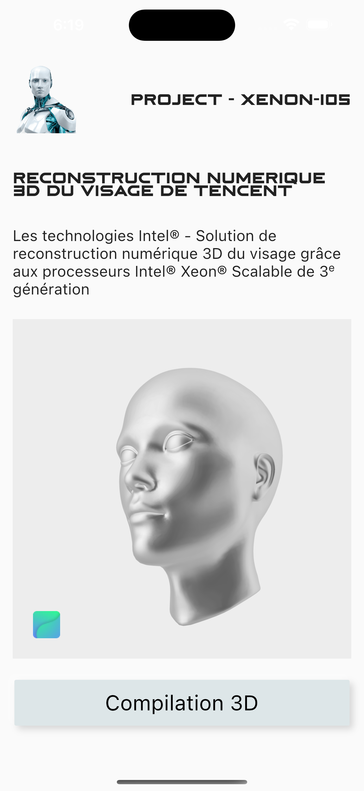

# flutter_effect_vectary
flutter_effect_vectary

## Getting Started

<table>
    <tr>
        <td> </td>
    </tr>
</table>

A few resources to get you started if this is your first Flutter project:

- [Lab: Write your first Flutter app](https://docs.flutter.dev/get-started/codelab)
- [Cookbook: Useful Flutter samples](https://docs.flutter.dev/cookbook)
